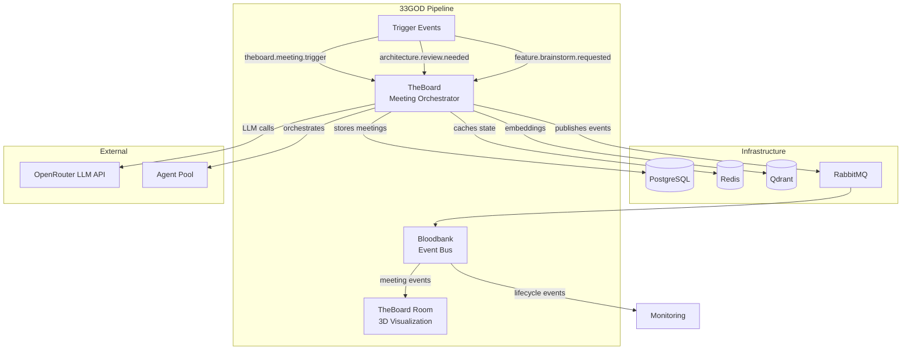
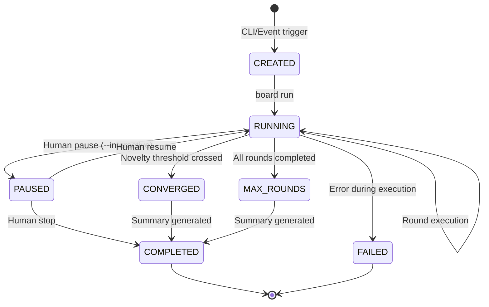
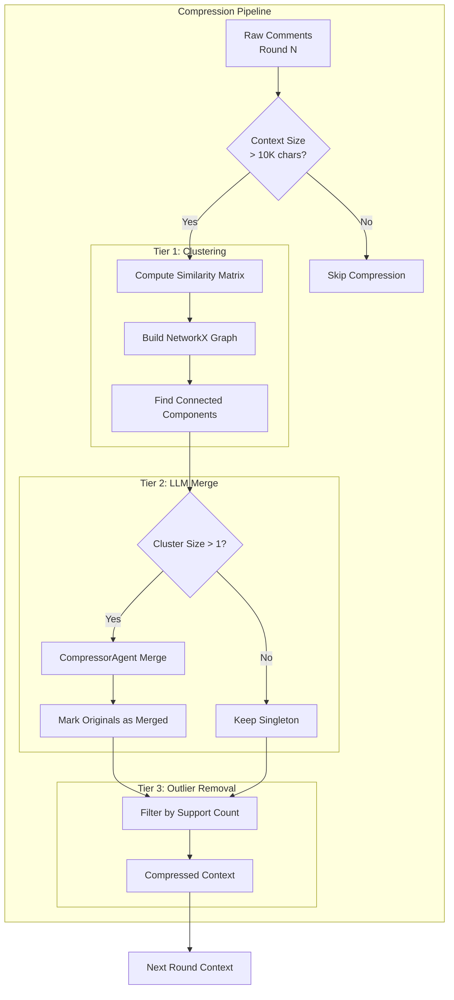

# TheBoard - GOD Document

> **Guaranteed Organizational Document** - Developer-facing reference for TheBoard
>
> **Last Updated**: 2026-02-02
> **Domain**: Meeting & Collaboration
> **Status**: Active (v2.1.0)

---

## Product Overview

**TheBoard** simulates corporate brainstorming retreats with AI agents. Given an artifact (implementation plan, git diff, requirements doc, product roadmap), TheBoard assembles a curated panel of domain experts, orchestrates multi-round discussions with structured turn-taking, and produces a refined output that has been examined through multiple perspectives.

The system draws inspiration from how real corporate teams collaborate: diverse experts taking turns, building on each other's ideas, debating alternatives, and ultimately converging on consensus. TheBoard automates this pattern with AI agents while maintaining transparency about costs, token usage, and discussion dynamics.

**Key Capabilities:**
- **Multi-Agent Brainstorming**: Orchestrate 10+ specialized AI agents with role-based expertise
- **Execution Strategies**: Sequential (thorough) or Greedy (parallel with N-squared comment-responses)
- **Convergence Detection**: Automatically stop meetings when ideas are exhausted (novelty-based)
- **Context Compression**: Three-tier strategy (clustering, LLM merge, outlier removal) reduces token usage by 40-60%
- **Delta Propagation**: Agents receive only new comments since their last turn (additional 40-60% token savings)
- **Human-in-the-Loop**: Real-time steering, pause/resume, and context modification during meetings
- **Export Capabilities**: Markdown, JSON, HTML, and custom Jinja2 template exports
- **Cost Tracking**: Per-agent and per-meeting cost breakdown with hybrid model optimization

---

## Architecture Position



**Role in Pipeline**: TheBoard is the **meeting orchestration engine** for the 33GOD system. It receives trigger events from upstream domains (Agent Orchestration, Development Tools), executes multi-round agent discussions, and emits lifecycle events to downstream consumers (TheBoard Room visualization, analytics, monitoring).

**Key Integration Points**:
1. **Inbound Events**: Receives meeting triggers from external domains requesting brainstorming sessions
2. **LLM Orchestration**: Coordinates multiple LLM calls per round with cost tracking
3. **Vector Search**: Uses Qdrant for novelty detection and semantic clustering
4. **Outbound Events**: Publishes comprehensive meeting lifecycle events to Bloodbank

---

## Event Contracts

### Bloodbank Events Emitted

| Event Name | Routing Key | Payload Schema | Trigger Condition |
|------------|-------------|----------------|-------------------|
| `meeting.created` | `theboard.meeting.created` | `MeetingCreatedEvent` | Meeting initialized via CLI or trigger |
| `meeting.started` | `theboard.meeting.started` | `MeetingStartedEvent` | Meeting transitions to RUNNING, agents selected |
| `meeting.round_completed` | `theboard.meeting.round_completed` | `RoundCompletedEvent` | Each agent completes their turn in a round |
| `meeting.comment_extracted` | `theboard.meeting.comment_extracted` | `CommentExtractedEvent` | Notetaker extracts comment from agent response |
| `meeting.converged` | `theboard.meeting.converged` | `MeetingConvergedEvent` | Average novelty falls below threshold |
| `meeting.completed` | `theboard.meeting.completed` | `MeetingCompletedEvent` | Meeting finishes (converged or max rounds) |
| `meeting.failed` | `theboard.meeting.failed` | `MeetingFailedEvent` | Execution error or LLM failure |
| `meeting.paused` | `theboard.meeting.paused` | `MeetingPausedEvent` | Human pauses meeting for steering |
| `meeting.resumed` | `theboard.meeting.resumed` | `MeetingResumedEvent` | Meeting resumes from paused state |
| `meeting.context.modified` | `theboard.meeting.context.modified` | `ContextModifiedEvent` | Human adds steering context during pause |
| `meeting.human.input.needed` | `theboard.meeting.human.input.needed` | `HumanInputNeededEvent` | Interactive mode awaiting human decision |
| `service.registered` | `theboard.service.registered` | `ServiceRegisteredPayload` | API service starts up |
| `service.health` | `theboard.service.health` | `ServiceHealthPayload` | Periodic health beacon (every 60s) |

### Event Payload Details

**MeetingCompletedEvent** (Phase 3A Enhanced):
```python
{
    "meeting_id": UUID,
    "total_rounds": int,
    "total_comments": int,
    "total_cost": float,
    "convergence_detected": bool,
    "stopping_reason": str,
    "top_comments": [  # Top 5 by novelty score
        {
            "text": str,
            "category": str,
            "novelty_score": float,
            "agent_name": str,
            "round_num": int
        }
    ],
    "category_distribution": {"idea": 5, "concern": 3, ...},
    "agent_participation": {"Architect": 3, "Security Expert": 2, ...}
}
```

### Bloodbank Events Consumed

| Event Name | Routing Key | Handler | Purpose |
|------------|-------------|---------|---------|
| `theboard.meeting.trigger` | `theboard.meeting.trigger` | `handle_meeting_trigger()` | Generic manual meeting trigger |
| `feature.brainstorm.requested` | `feature.brainstorm.requested` | `handle_feature_brainstorm()` | Feature design discussion trigger |
| `architecture.review.needed` | `architecture.review.needed` | `handle_architecture_review()` | Architecture review meeting trigger |

**Note**: Event consumption is implemented via RabbitMQ subscription. The service subscribes on startup and routes events to appropriate handlers.

---

## Non-Event Interfaces

### CLI Interface

```bash
# Create a meeting with topic-based agent selection
board create --topic "Design a mobile app feature for tracking water intake" \
             --strategy sequential \
             --max-rounds 5 \
             --agent-count 5

# Run a meeting with live progress display
board run <meeting-id>

# Run with human-in-the-loop steering
board run <meeting-id> --interactive

# Run with model override
board run <meeting-id> --model anthropic/claude-sonnet-4

# Export meeting results
board export <meeting-id> --format markdown --output report.md

# Check meeting status with metrics
board status <meeting-id> --comments --metrics

# Interactive wizard for meeting setup
board wizard create

# List available agents
board agents list

# Seed agents from pool file
board agents seed --file data/agents/initial_pool.yaml
```

**Commands:**

| Command | Description | Key Options |
|---------|-------------|-------------|
| `board create` | Create a new meeting | `--topic`, `--strategy`, `--max-rounds`, `--agent-count` |
| `board run` | Execute a meeting | `--interactive`, `--rerun`, `--fork`, `--model` |
| `board status` | Display meeting state | `--comments`, `--metrics` |
| `board export` | Export meeting results | `--format`, `--output`, `--template` |
| `board wizard create` | Interactive meeting setup | (guided prompts) |
| `board agents list` | List agent pool | `--active-only` |
| `board agents seed` | Seed agents from YAML | `--file` |
| `board config show` | Display current config | - |
| `board version` | Display version info | - |

### API Interface

**Base URL**: `http://localhost:8000`

**Endpoints:**

| Method | Path | Description |
|--------|------|-------------|
| `GET` | `/` | Service information |
| `GET` | `/health` | Health check with dependency status |
| `GET` | `/docs` | OpenAPI documentation (Swagger) |
| `GET` | `/redoc` | ReDoc API documentation |

**Health Check Response:**
```json
{
    "status": "healthy|degraded|unhealthy",
    "timestamp": "2026-02-02T12:00:00Z",
    "version": "2.1.0",
    "database": "connected|disconnected|error",
    "redis": "connected|disconnected|error",
    "bloodbank": "connected|disconnected|disabled",
    "details": {}
}
```

---

## Technical Deep-Dive

### Technology Stack

- **Language**: Python 3.12+
- **Framework**: FastAPI (API), Typer (CLI), Rich (Terminal UI)
- **ORM**: SQLAlchemy 2.0 with Alembic migrations
- **LLM Integration**: OpenRouter API via LiteLLM abstraction
- **Agent Framework**: Agno for multi-agent orchestration
- **Dependencies**:
  - `pydantic` - Data validation and serialization
  - `sentence-transformers` - Embedding generation (all-MiniLM-L6-v2)
  - `networkx` - Graph-based clustering for compression
  - `aio-pika` - RabbitMQ async client for Bloodbank integration

### Architecture Pattern

TheBoard follows a **layered service architecture** with clear separation of concerns:

```
CLI Layer (cli.py, cli_commands/)
    ↓ Commands & User Input
Service Layer (services/)
    ↓ Business Logic
Workflow Layer (workflows/)
    ↓ Orchestration
Agent Layer (agents/)
    ↓ LLM Interactions
Data Layer (models/, database.py)
    ↓ Persistence
Infrastructure Layer (events/, utils/)
    ↓ Cross-cutting Concerns
```

**Key Patterns:**
- **Session-per-Request**: Database sessions are short-lived and never held during LLM calls
- **Event-First Design**: All state transitions emit Bloodbank events
- **Lazy Evaluation**: Compression triggers only when context exceeds threshold
- **Delta Propagation**: Agents track their last-seen round for incremental context

### Key Implementation Details

#### Session Management (Critical)

**Never hold database sessions during LLM calls** to prevent connection pool exhaustion:

```python
# CORRECT Pattern (Sprint 1.5)
with get_sync_db() as db:
    meeting = db.query(Meeting).filter_by(id=meeting_id).first()
    topic = meeting.topic
# Session closed

result = agent.run(topic)  # LLM call without session

with get_sync_db() as db:  # New session for storage
    db.add(Response(...))
    db.commit()
```

#### Convergence Detection

Meetings converge when:
1. **Minimum rounds reached**: `round_num >= min_rounds` (default: 2)
2. **Novelty threshold crossed**: `avg_novelty < novelty_threshold` (default: 0.3)

```python
# Convergence check
if round_num >= self.min_rounds and avg_novelty < self.novelty_threshold:
    converged = True
    # Emit MeetingConvergedEvent
```

#### Three-Tier Compression Strategy

**Tier 1 - Graph-Based Clustering:**
- Compute pairwise similarity matrix using Qdrant embeddings
- Build NetworkX graph with edges for similarity >= 0.85
- Find connected components as clusters

**Tier 2 - LLM Semantic Merge:**
- For multi-comment clusters: Use CompressorAgent to merge
- Singletons: Keep as-is with support_count = 1
- Mark original comments as `is_merged = True`

**Tier 3 - Outlier Removal:**
- Filter comments with `support_count < outlier_threshold` (default: 2)
- Removes rare, unsupported ideas

**Result**: 40-60% token reduction with quality preservation.

#### Delta Context Propagation

Each agent tracks when they last participated. On subsequent turns, only new comments are included:

```python
# Track agent's last seen round
self.agent_last_seen_round[str(agent.id)] = round_num

# Build delta context for next round
if agent_id in self.agent_last_seen_round:
    start_round = self.agent_last_seen_round[agent_id] + 1
    # Only include comments from start_round to current_round
```

#### Greedy Execution Strategy (Sprint 4)

The greedy strategy uses parallel execution:

**Phase 1 - Parallel Response:**
- All agents respond to the same context simultaneously via `asyncio.gather`
- Significantly faster than sequential

**Phase 2 - Comment-Response:**
- Each agent responds to other agents' comments (N-squared interactions)
- Higher token cost but richer discussion dynamics

### Data Models

**Core Entities:**

```python
# Meeting - Brainstorming session
class Meeting:
    id: UUID
    topic: str              # 10-500 chars
    strategy: str           # 'sequential' | 'greedy'
    status: str             # created | running | paused | completed | failed
    current_round: int
    max_rounds: int
    total_comments: int
    total_cost: float
    context_size: int
    convergence_detected: bool
    stopping_reason: str | None
    model_override: str | None

# Agent - AI expert from pool
class Agent:
    id: UUID
    name: str               # Unique identifier
    expertise: str          # Domain area
    persona: str | None     # Behavioral characteristics
    background: str | None  # Additional context
    agent_type: str         # 'plaintext' | 'letta'
    default_model: str
    is_active: bool

# Response - Agent's contribution
class Response:
    id: UUID
    meeting_id: UUID
    agent_id: UUID
    round: int
    agent_name: str
    response_text: str
    model_used: str
    tokens_used: int
    cost: float
    context_size: int

# Comment - Extracted insight
class Comment:
    id: UUID
    meeting_id: UUID
    response_id: UUID
    round: int
    agent_name: str
    text: str
    category: str           # question | idea | concern | suggestion | ...
    novelty_score: float    # 0.0 - 1.0
    support_count: int      # Merge count
    is_merged: bool         # Marked when merged into another
    embedding_id: str | None
```

### Configuration

**Environment Variables:**

| Variable | Purpose | Default |
|----------|---------|---------|
| `DATABASE_URL` | PostgreSQL connection | `postgresql+psycopg://...` |
| `REDIS_URL` | Redis connection | `redis://...` |
| `RABBITMQ_URL` | RabbitMQ connection | `amqp://...` |
| `QDRANT_URL` | Qdrant connection | `http://localhost:6333` |
| `OPENROUTER_API_KEY` | LLM API key | (required) |
| `THEBOARD_EVENT_EMITTER` | Event mode | `null` | `rabbitmq` | `inmemory` |

**Config File** (`~/.config/theboard/config.yml`):
```yaml
event_emitter: rabbitmq
log_level: INFO
debug: false
default_strategy: sequential
max_rounds: 5
convergence_threshold: 0.3
lazy_compression_threshold: 10000
```

**Model Selection Hierarchy:**
1. CLI `--model` argument (highest priority)
2. Meeting-level `model_override`
3. Agent-level `preferred_model`
4. User preferences from config
5. System default (`anthropic/claude-sonnet-4`)

---

## Meeting Lifecycle



**State Transitions:**
- `CREATED`: Meeting initialized, agents not yet selected
- `RUNNING`: Active execution with agents participating
- `PAUSED`: Waiting for human input (interactive mode only)
- `COMPLETED`: Successfully finished (converged or max rounds)
- `FAILED`: Execution error, LLM failure, or configuration issue

---

## Context Compression Architecture



**Compression Metrics:**
- `original_count`: Comments before compression
- `compressed_count`: Comments after compression
- `compression_ratio`: compressed / original
- `reduction_percentage`: (1 - ratio) * 100

---

## Meeting Trigger Events

TheBoard responds to multiple trigger event types:

| Event | Purpose | Typical Source |
|-------|---------|----------------|
| `theboard.meeting.trigger` | Generic manual trigger | CLI `board run` command |
| `feature.brainstorm.requested` | Feature design discussion | Agent Orchestration domain |
| `architecture.review.needed` | Architecture review meeting | Development Tools domain |
| `incident.postmortem.scheduled` | Post-incident analysis | Ops/Monitoring domain |
| `decision.analysis.required` | Decision tree exploration | Agent Orchestration domain |

**Trigger Payload Structure:**
```json
{
    "correlation_id": "uuid",
    "topic": "Feature design: User authentication redesign",
    "context": "We need to migrate from JWT to session-based auth...",
    "required_roles": ["security-expert", "backend-architect", "frontend-dev"],
    "max_rounds": 5,
    "urgency": "normal|high|critical"
}
```

---

## Development

### Setup

```bash
# Clone repository
cd /home/delorenj/code/33GOD/theboard

# Install dependencies with uv
uv sync

# Copy environment file
cp .env.example .env
# Edit .env and add OPENROUTER_API_KEY

# Start infrastructure
docker compose up -d postgres redis rabbitmq qdrant

# Run database migrations
source .venv/bin/activate
alembic upgrade head

# Seed initial agent pool
python scripts/seed_agents.py
```

### Running Locally

```bash
# CLI commands (local development)
board create --topic "Test brainstorming" --max-rounds 2
board run <meeting-id>
board status <meeting-id>

# Start API server
uvicorn theboard.api:app --host 0.0.0.0 --port 8000 --reload

# Run via uv without activating venv
uv run board create --topic "Test topic"
```

### Testing

```bash
# Run all tests with coverage
pytest

# Run specific test categories
pytest tests/unit/
pytest tests/integration/
pytest tests/performance/

# With verbose output and HTML coverage report
pytest -v --cov=theboard --cov-report=html

# Run single test file
pytest tests/unit/test_agents.py
```

### Code Quality

```bash
# Lint check
ruff check src/

# Auto-fix linting issues
ruff check --fix src/

# Type checking
mypy src/
```

---

## Deployment

### Docker Compose (Recommended)

```bash
# Start all services
docker compose up -d

# View logs
docker compose logs -f theboard

# Execute CLI commands in container
docker compose exec theboard uv run board create --topic "Test meeting"
docker compose exec theboard uv run board run <meeting-id>
```

**Container Ports:**
- `8000`: TheBoard API
- `5433`: PostgreSQL (mapped from 5432)
- `6380`: Redis (mapped from 6379)
- `5673`: RabbitMQ (mapped from 5672)
- `15673`: RabbitMQ Management UI
- `6335`: Qdrant (mapped from 6333)

### Production Considerations

- Set strong database passwords via environment variables
- Enable SSL/TLS for all connections
- Configure log aggregation (ELK, Loki)
- Set resource limits in Docker Compose
- Enable health checks for all services
- Use secrets management (AWS Secrets Manager, HashiCorp Vault)

---

## Troubleshooting

### Common Issues

**"No module named 'theboard'":**
- Ensure virtual environment is activated or use `uv run`

**"Connection to database failed":**
- Check PostgreSQL is running on port 5433 (not 5432)
- Verify `DATABASE_URL` environment variable

**"Redis connection refused":**
- Check Redis is running on port 6380 (not 6379)

**"Event emission failed":**
- Bloodbank not found, set `THEBOARD_EVENT_EMITTER=null` to disable
- Verify RabbitMQ is running and accessible

**"Test suite hangs":**
- Likely async/sync event loop conflict, run with `pytest -v` for details

### Debug Mode

Enable debug logging in config:
```yaml
# ~/.config/theboard/config.yml
debug: true
log_level: DEBUG
```

Check `debug.log` for detailed traces.

---

## References

- **Domain Doc**: `docs/domains/meeting-collaboration/GOD.md`
- **System Doc**: `docs/GOD.md`
- **Source**: `theboard/src/theboard/`
- **User Guide**: `theboard/docs/USER_GUIDE.md`
- **Developer Docs**: `theboard/docs/DEVELOPER.md`
- **Bloodbank Integration**: `theboard/BLOODBANK_INTEGRATION.md`
- **Troubleshooting**: `theboard/docs/TROUBLESHOOTING.md`
- **Agent Pool**: `theboard/data/agents/initial_pool.yaml`
- **Event Schemas**: `theboard/src/theboard/events/schemas.py`
