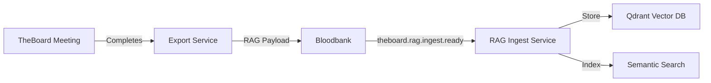

# TheBoard RAG Integration Payload Schema

**Version**: 1.0
**Status**: Design Complete
**Target**: Phase 3 Implementation

## Overview

This document defines the event payload schemas for TheBoard RAG (Retrieval-Augmented Generation) integration, enabling meeting transcripts, insights, and agent knowledge to flow into the ecosystem's vector database for future retrieval.

## Architecture



## Event Types

### 1. Primary RAG Ingest Event

**Event**: `theboard.rag.ingest.ready`
**Trigger**: Meeting completion with successful convergence
**Purpose**: Bulk ingestion of meeting artifacts into vector database

### 2. Incremental Update Events

**Event**: `theboard.rag.insight.extracted`
**Trigger**: High-value comment identified during meeting
**Purpose**: Real-time ingestion of critical insights

**Event**: `theboard.rag.agent.profile.updated`
**Trigger**: Agent demonstrates new expertise during meeting
**Purpose**: Update agent capability index

## Payload Schemas

### MeetingRAGPayload (Primary)

Complete meeting transcript ready for RAG ingestion.

```python
from datetime import datetime
from typing import Literal
from uuid import UUID

from pydantic import BaseModel, Field


class CommentEmbedding(BaseModel):
    """Individual comment with pre-computed embedding."""

    comment_id: UUID = Field(description="Comment UUID")
    content: str = Field(description="Comment text content")
    category: Literal[
        "idea",
        "question",
        "concern",
        "observation",
        "recommendation",
        "critique",
        "insight",
    ] = Field(description="Comment category")
    speaker: str = Field(description="Agent name that made comment")
    round_number: int = Field(description="Round in which comment was made")
    novelty_score: float | None = Field(
        default=None,
        ge=0.0,
        le=1.0,
        description="Novelty score (0=redundant, 1=novel)",
    )
    embedding: list[float] = Field(
        description="Pre-computed embedding vector (384-dim for all-MiniLM-L6-v2)"
    )
    metadata: dict[str, str] | None = Field(
        default=None, description="Additional metadata"
    )


class AgentContribution(BaseModel):
    """Agent's contribution summary for meeting."""

    agent_id: UUID = Field(description="Agent UUID")
    agent_name: str = Field(description="Agent display name")
    expertise: str = Field(description="Agent's domain expertise")
    persona: str = Field(description="Agent persona description")
    comment_count: int = Field(description="Number of comments made")
    rounds_participated: list[int] = Field(
        description="List of rounds where agent participated"
    )
    avg_novelty_score: float | None = Field(
        default=None, description="Average novelty of agent's comments"
    )
    top_insights: list[str] = Field(
        default_factory=list,
        max_length=3,
        description="Top 3 insights from this agent",
    )


class MeetingRAGPayload(BaseModel):
    """Complete meeting payload for RAG ingestion."""

    # Meeting identifiers
    meeting_id: UUID = Field(description="Meeting UUID")
    topic: str = Field(description="Meeting topic")
    created_at: datetime = Field(description="Meeting creation timestamp")
    completed_at: datetime = Field(description="Meeting completion timestamp")

    # Meeting configuration
    strategy: Literal["sequential", "greedy"] = Field(
        description="Execution strategy used"
    )
    rounds_completed: int = Field(description="Number of rounds completed")
    converged: bool = Field(description="Whether meeting converged")
    convergence_round: int | None = Field(
        default=None, description="Round at which convergence detected"
    )

    # Comments with embeddings
    comments: list[CommentEmbedding] = Field(
        description="All meeting comments with embeddings"
    )
    total_comments: int = Field(description="Total comment count")
    compressed_comments: int | None = Field(
        default=None, description="Number of comments after compression"
    )

    # Agent contributions
    agents: list[AgentContribution] = Field(
        description="Agent contribution summaries"
    )

    # Summary and insights
    executive_summary: str | None = Field(
        default=None, description="AI-generated meeting summary"
    )
    key_insights: list[str] = Field(
        default_factory=list,
        max_length=10,
        description="Top 10 insights from meeting",
    )
    action_items: list[str] = Field(
        default_factory=list, description="Extracted action items"
    )
    decisions_made: list[str] = Field(
        default_factory=list, description="Decisions reached"
    )
    open_questions: list[str] = Field(
        default_factory=list, description="Unresolved questions"
    )

    # Cost and performance metrics
    total_cost_usd: float | None = Field(default=None, description="Total LLM cost")
    total_tokens: int | None = Field(default=None, description="Total tokens used")
    compression_ratio: float | None = Field(
        default=None, description="Context compression ratio achieved"
    )
    execution_time_seconds: int | None = Field(
        default=None, description="Total execution time"
    )

    # Metadata for retrieval
    tags: list[str] = Field(
        default_factory=list, description="Topic tags for retrieval"
    )
    related_meetings: list[UUID] = Field(
        default_factory=list, description="IDs of related past meetings"
    )
    source_context: dict[str, str] | None = Field(
        default=None, description="Context that triggered meeting (if any)"
    )


class InsightExtractionPayload(BaseModel):
    """Real-time insight extraction event."""

    meeting_id: UUID = Field(description="Meeting UUID")
    insight_id: UUID = Field(description="Insight UUID")
    insight_text: str = Field(description="Insight content")
    category: Literal[
        "breakthrough", "pattern", "risk", "opportunity", "constraint"
    ] = Field(description="Insight category")
    round_number: int = Field(description="Round where insight emerged")
    confidence: float = Field(
        ge=0.0, le=1.0, description="Confidence in insight quality"
    )
    embedding: list[float] = Field(description="Insight embedding vector")
    related_comments: list[UUID] = Field(
        description="Comments that contributed to this insight"
    )


class AgentProfileUpdatePayload(BaseModel):
    """Agent capability profile update."""

    agent_id: UUID = Field(description="Agent UUID")
    agent_name: str = Field(description="Agent name")
    meeting_id: UUID = Field(description="Meeting that triggered update")
    new_capabilities: list[str] = Field(
        description="Newly demonstrated capabilities"
    )
    expertise_areas: list[str] = Field(description="Updated expertise areas")
    performance_metrics: dict[str, float] = Field(
        description="Performance metrics from this meeting"
    )
    embedding: list[float] = Field(
        description="Updated agent capability embedding"
    )
```

## Event Emission Flow

### Phase 1: Meeting Completion

```python
# In workflows/multi_agent_meeting.py after meeting completes

from theboard.services.rag_exporter import RAGExporter
from theboard.events.emitter import get_event_emitter

async def _finalize_meeting(self, meeting_id: UUID):
    """Finalize meeting and emit RAG payload."""

    # Export RAG payload
    exporter = RAGExporter()
    rag_payload = await exporter.export_meeting_for_rag(meeting_id)

    # Emit event
    emitter = get_event_emitter()
    await emitter.emit_rag_ingest_ready(rag_payload)

    logger.info(
        f"Emitted RAG payload for meeting {meeting_id}: "
        f"{len(rag_payload.comments)} comments, "
        f"{len(rag_payload.key_insights)} insights"
    )
```

### Phase 2: Real-Time Insight Extraction

```python
# In workflows/multi_agent_meeting.py during meeting execution

async def _extract_insights_realtime(self, comments: list[Comment]):
    """Extract high-value insights in real-time."""

    insight_detector = InsightDetector()

    for comment in comments:
        if insight_detector.is_breakthrough(comment):
            # Generate embedding
            embedding = await self.embedding_service.get_embedding(comment.content)

            # Emit insight event
            await emitter.emit_insight_extracted(
                meeting_id=self.meeting_id,
                insight_id=comment.id,
                insight_text=comment.content,
                category="breakthrough",
                round_number=comment.round_number,
                confidence=0.85,
                embedding=embedding,
                related_comments=[comment.id],
            )
```

## RAG Ingest Service

New consumer service to be created: `theboard-rag-ingest`

```python
"""RAG ingest service for TheBoard meetings."""

from event_producers import EventConsumer, EventEnvelope
from qdrant_client import QdrantClient
from qdrant_client.models import Distance, PointStruct, VectorParams


class TheboardRAGIngestConsumer(EventConsumer):
    """Ingests TheBoard meeting data into Qdrant."""

    queue_name = "theboard_rag_ingest_queue"
    routing_keys = [
        "theboard.rag.ingest.ready",
        "theboard.rag.insight.extracted",
        "theboard.rag.agent.profile.updated",
    ]

    def __init__(self):
        super().__init__()
        self.qdrant = QdrantClient(url="http://qdrant:6333")
        self._ensure_collections()

    def _ensure_collections(self):
        """Ensure Qdrant collections exist."""
        collections = {
            "theboard_comments": 384,  # all-MiniLM-L6-v2 dimension
            "theboard_insights": 384,
            "theboard_agents": 384,
        }

        for collection_name, vector_size in collections.items():
            if not self.qdrant.collection_exists(collection_name):
                self.qdrant.create_collection(
                    collection_name=collection_name,
                    vectors_config=VectorParams(
                        size=vector_size,
                        distance=Distance.COSINE,
                    ),
                )

    @EventConsumer.event_handler("theboard.rag.ingest.ready")
    async def handle_meeting_ingest(self, envelope: EventEnvelope):
        """Ingest complete meeting into Qdrant."""
        payload = MeetingRAGPayload(**envelope.payload)

        # Ingest comments
        points = [
            PointStruct(
                id=str(comment.comment_id),
                vector=comment.embedding,
                payload={
                    "meeting_id": str(payload.meeting_id),
                    "content": comment.content,
                    "category": comment.category,
                    "speaker": comment.speaker,
                    "round": comment.round_number,
                    "novelty": comment.novelty_score,
                    "topic": payload.topic,
                    "tags": payload.tags,
                },
            )
            for comment in payload.comments
        ]

        self.qdrant.upsert(
            collection_name="theboard_comments",
            points=points,
        )

        logger.info(
            f"Ingested {len(points)} comments from meeting {payload.meeting_id}"
        )

    @EventConsumer.event_handler("theboard.rag.insight.extracted")
    async def handle_insight_extraction(self, envelope: EventEnvelope):
        """Ingest real-time insight."""
        payload = InsightExtractionPayload(**envelope.payload)

        point = PointStruct(
            id=str(payload.insight_id),
            vector=payload.embedding,
            payload={
                "meeting_id": str(payload.meeting_id),
                "insight_text": payload.insight_text,
                "category": payload.category,
                "round": payload.round_number,
                "confidence": payload.confidence,
            },
        )

        self.qdrant.upsert(
            collection_name="theboard_insights",
            points=[point],
        )
```

## Retrieval Query Examples

### Semantic Search Across Meetings

```python
from qdrant_client import QdrantClient
from sentence_transformers import SentenceTransformer

client = QdrantClient(url="http://qdrant:6333")
model = SentenceTransformer("sentence-transformers/all-MiniLM-L6-v2")

# Query: "What have we discussed about microservices architecture?"
query_embedding = model.encode("microservices architecture patterns").tolist()

results = client.search(
    collection_name="theboard_comments",
    query_vector=query_embedding,
    limit=10,
    query_filter={
        "must": [
            {"key": "category", "match": {"value": "idea"}},
            {"key": "novelty", "range": {"gte": 0.7}},  # High novelty only
        ]
    },
)

# Results contain semantically similar comments from all past meetings
for hit in results:
    print(f"Score: {hit.score:.3f}")
    print(f"Meeting: {hit.payload['topic']}")
    print(f"Comment: {hit.payload['content']}")
    print(f"Speaker: {hit.payload['speaker']}")
    print("---")
```

### Find Related Past Meetings

```python
# Given current meeting topic, find similar past discussions
current_topic = "API gateway design for microservices"
topic_embedding = model.encode(current_topic).tolist()

similar_meetings = client.search(
    collection_name="theboard_comments",
    query_vector=topic_embedding,
    limit=5,
    with_payload=["meeting_id", "topic", "tags"],
)

# Group by meeting_id to get unique meetings
unique_meetings = {}
for hit in similar_meetings:
    meeting_id = hit.payload["meeting_id"]
    if meeting_id not in unique_meetings:
        unique_meetings[meeting_id] = hit.payload["topic"]

print("Related past meetings:")
for meeting_id, topic in unique_meetings.items():
    print(f"- {topic} (ID: {meeting_id})")
```

## Implementation Checklist

### Phase 3A: Export Service (M effort)

- [ ] Create `/home/delorenj/code/33GOD/theboard/trunk-main/src/theboard/services/rag_exporter.py`
- [ ] Implement `RAGExporter.export_meeting_for_rag()` method
- [ ] Add embedding generation for all comments
- [ ] Add executive summary generation (optional)
- [ ] Add key insights extraction
- [ ] Add event emission to `workflows/multi_agent_meeting.py`
- [ ] Unit tests for RAGExporter

### Phase 3B: RAG Ingest Service (M effort)

- [ ] Create `/home/delorenj/code/33GOD/services/theboard-rag-ingest/`
- [ ] Implement Qdrant collection management
- [ ] Implement batch comment ingestion
- [ ] Implement real-time insight ingestion
- [ ] Add error handling and retry logic
- [ ] Integration tests with Qdrant
- [ ] Update `services/registry.yaml`

### Phase 3C: Query Interface (Optional)

- [ ] Create CLI command `board query "search text"`
- [ ] Implement semantic search function
- [ ] Implement meeting similarity search
- [ ] Add result formatting

## Storage Estimates

**Per Meeting:**
- Comments: ~50-200 comments × 384 floats × 4 bytes = ~77KB-308KB vectors
- Metadata: ~10KB-50KB JSON payloads
- **Total**: ~90KB-360KB per meeting

**At Scale (1000 meetings):**
- Vector storage: ~90MB-360MB
- Metadata storage: ~10MB-50MB
- **Total**: ~100MB-410MB

Qdrant can easily handle this volume. For 10K+ meetings, consider:
- Sharding by date range
- Archiving meetings >1 year old
- Aggregating similar comments

## Security Considerations

1. **Sensitive Meeting Topics**: Add `is_sensitive: bool` flag to MeetingRAGPayload
2. **Access Control**: Implement Qdrant collection-level permissions
3. **PII Scrubbing**: Sanitize comment content before embedding
4. **Audit Trail**: Log all RAG queries for compliance

## Future Enhancements

1. **Multi-Modal Embeddings**: Support images, diagrams from meeting artifacts
2. **Cross-Meeting Insights**: Detect patterns across meetings over time
3. **Agent Clustering**: Group agents by demonstrated capabilities
4. **Temporal Decay**: Weight recent meetings higher in search results
5. **Federated Search**: Query across TheBoard, Fireflies transcripts, and docs simultaneously

## References

- Qdrant Documentation: https://qdrant.tech/documentation/
- Sentence Transformers: https://www.sbert.net/
- TheBoard Event Schemas: `/home/delorenj/code/33GOD/theboard/trunk-main/src/theboard/events/schemas.py`
- Bloodbank Integration: `/home/delorenj/code/33GOD/theboard/trunk-main/BLOODBANK_INTEGRATION.md`
