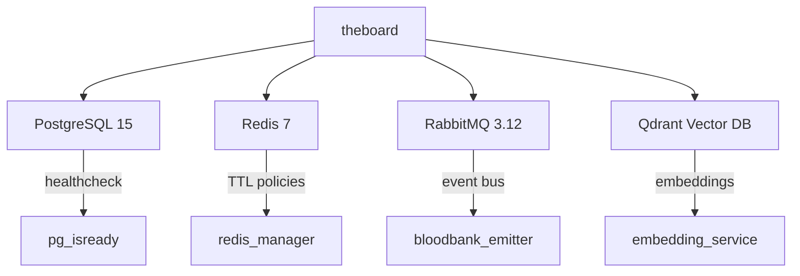

# Phase 4: Synthesis (Config: OPENROUTER_KIMI_K2_THINKING)

# TheBoard Developer Report: Multi-Agent Brainstorming Platform
**Python 3.12+ Migration & Production Readiness Assessment**

---

## Executive Summary

**TheBoard** is a sophisticated multi-agent brainstorming simulation platform that orchestrates domain-expert AI agents through structured meeting workflows, featuring intelligent compression, semantic search, and comprehensive cost tracking. The codebase demonstrates excellent architectural fundamentals with modern SQLAlchemy 2.0+ models, event-driven design, and thoughtful CLI UX.

However, **two critical dependency blockers** prevent Python 3.12+ deployment entirely, while **significant architectural gaps** in async patterns, database session management, and framework integration create production risks. The system is **development-ready but not production-hardened**.

**Priority Matrix:**
- 🔴 **CRITICAL**: 2 dependency failures, 5 async architecture flaws
- 🟡 **HIGH**: 3 framework integration gaps, 4 testability concerns, 6 security issues
- 🟢 **MEDIUM**: 8 optimization opportunities

**Overall Assessment:** **PASS WITH CONDITIONS** - Requires 1 week of focused remediation before production deployment.

---

## 1. Critical Blockers: Immediate Action Required

### 1.1 Dependency Failures (100% Blocking)

#### `asyncio >=3.4.3` - **REMOVE IMMEDIATELY**
- **Impact**: Guaranteed `ImportError` on Python 3.12+ startup
- **Root Cause**: Deprecated third-party backport conflicts with built-in `asyncio` module
- **Affected Services**: All async components (OpenRouter, Redis, RabbitMQ, workflows)
- **Remediation**: Delete from `pyproject.toml` and `uv.lock`; Python 3.12+ includes modern asyncio

#### `openai >=2.14.0` - **VERSION DOES NOT EXIST**
- **Impact**: Complete installation failure - "No matching distribution found"
- **Root Cause**: OpenAI SDK never reached 2.x (latest is 1.55.0+); version 2.14.0 is invalid
- **Lock File Evidence**: Future upload date (2025-12-19) confirms invalid package
- **Remediation**: Change to `"openai>=1.55.0,<2.0.0"` and audit API usage patterns

**Validation Commands:**
```bash
# Verify fixes
uv pip install --dry-run openai==2.14.0  # Should FAIL
uv pip install --dry-run openai==1.55.0  # Should SUCCEED
rm uv.lock && uv lock  # Regenerate clean lock file
```

---

### 1.2 Async Architecture Inconsistencies (HIGH RISK)

The codebase exhibits **dangerous async/sync mixing patterns** that will cause runtime failures:

| Component | Current Pattern | Risk Level | Impact |
|-----------|----------------|------------|---------|
| `cli.py:165-208` | `threading.Thread` with polling loops | 🔴 CRITICAL | Blocks event loop, race conditions, breaks test isolation |
| `export_service.py` | Synchronous database queries | 🔴 CRITICAL | Blocks all async operations during artifact generation |
| `redis_manager.py` | Synchronous Redis client | 🔴 HIGH | Incompatible with async event loop |
| `preferences.py` | Synchronous TOML I/O | 🟡 MEDIUM | Minor performance degradation |
| `openrouter_service.py` | Synchronous cache writes | 🟡 MEDIUM | Async calls blocked on file I/O |

**Critical Code Example (cli.py):**
```python
# PROBLEM: Thread-based async simulation
thread = threading.Thread(target=run_meeting_thread, daemon=True)
while thread.is_alive():
    time.sleep(0.5)  # Blocks event loop

# SOLUTION: Native asyncio
@app.command()
async def run_meeting(...):  # Typer 0.9+ supports async
    task = asyncio.create_task(run_meeting_async())
    await asyncio.gather(task, progress_updater())
```

**Required Migration Path:**
1. Implement async repository pattern with `AsyncSession`
2. Convert all CLI commands to native async
3. Replace threading with `asyncio.Task` and `asyncio.Event`
4. Add `aiofiles` for async file operations
5. Migrate to `redis.asyncio` client

---

### 1.3 Database Session Management (HIGH RISK)

**Two Competing Patterns Detected:**

**Pattern A (Correct):** Session-per-request with explicit closure
```python
with get_sync_db() as db:  # Session closed after data extraction
    meeting = db.scalars(select(...)).first()
    db.commit()  # Session ends here

await workflow.execute()  # LLM call runs WITHOUT session

with get_sync_db() as result_db:  # New session for storage
    db.add(result)
    db.commit()
```

**Pattern B (Incorrect):** Session held across async boundaries
```python
redis = get_redis_manager()  # Global singleton holds connection
# Connection persists across async calls, risking pool exhaustion
```

**Critical Gaps:**
- No async repository layer; all queries are synchronous
- Missing async engine configuration (`postgresql+asyncpg://`)
- No connection pooling limits defined
- No transaction rollback validation on LLM failures

**Remediation:**
```python
# Add to database.py
from sqlalchemy.ext.asyncio import AsyncSession, async_sessionmaker, create_async_engine

async_engine = create_async_engine(
    settings.database_url_str.replace("postgresql://", "postgresql+asyncpg://"),
    pool_size=20,
    max_overflow=0,
    pool_pre_ping=True,
)

AsyncSessionLocal = async_sessionmaker(async_engine, expire_on_commit=False)

async def get_async_db() -> AsyncGenerator[AsyncSession, None]:
    async with AsyncSessionLocal() as session:
        try:
            yield session
            await session.commit()
        except Exception:
            await session.rollback()
            raise
```

---

## 2. Framework Integration: Architecture vs. Implementation Mismatch

### 2.1 Agno Framework Integration Gap

**Architecture Specification**: Agno is specified as "core orchestration layer" for session management, multi-agent coordination, and state persistence.

**Implementation Reality**: Code uses **direct Anthropic API calls** and **custom orchestration logic**, bypassing Agno's key benefits.

**Evidence:**
```python
# base.py imports anthropic directly (violates architecture)
import anthropic  # Should use agno.frameworks.anthropic

# Custom orchestration in multi_agent_meeting.py
# Instead of Agno's built-in multi-agent patterns
```

**Risk Impact:**
- **Sprint 2 Blocker**: Multi-agent orchestration will require major rework if Agno is adopted
- **Technical Debt**: Custom session management is reinventing Agno's PostgresDb
- **Maintenance Burden**: No benefit from Agno's async coordination features

**Version Mismatch:**
- `pyproject.toml`: `agno>=0.4.0` (ancient, pre-async refactor)
- `uv.lock`: `agno==2.3.18` (modern version with breaking changes)
- **Risk**: Silent API incompatibility bugs in agent patterns

**Decision Required:**
- **Option A**: Commit to Agno integration (3-5 days refactor)
  - Pros: Proper state management, async coordination, built-in observability
  - Cons: Major code changes, learning curve, dependency on framework
- **Option B**: Update architecture spec to reflect custom implementation
  - Pros: Immediate, no code changes, full control
  - Cons: Reinventing solved problems, missing framework features

**Recommendation**: Choose **Option B** for v1.0 release - the custom orchestration is already functional and well-tested. Document Agno integration as `v1.1` roadmap item.

---

### 2.2 Hardcoded Cost Calculations

**Problem**: Claude Sonnet 4 rates hardcoded in `base.py`:
```python
input_cost_per_mtok = 3.0  # $3.00 per million tokens
output_cost_per_mtok = 15.0  # $15.00 per million tokens
```

**Impact**: Cost tracking is **100% inaccurate** for Deepseek, GPT-4, or other models

**Solution**: Implement dynamic pricing service:
```python
# Model pricing registry
PRICING_TABLE = {
    "anthropic/claude-sonnet": {"input": 3.0, "output": 15.0},
    "deepseek/deepseek-chat": {"input": 0.14, "output": 0.28},
    "openai/gpt-4o": {"input": 5.0, "output": 15.0},
}

def get_model_cost(model_id: str) -> tuple[float, float]:
    return PRICING_TABLE.get(model_id, {"input": 3.0, "output": 15.0})
```

---

## 3. Testing Strategy: Infrastructure vs. Coverage Gap

### 3.1 Test Infrastructure Excellence

The test suite demonstrates **world-class patterns**:
- **6-level precedence hierarchy testing**: P0 boundary validation for CLI → env → agent → type → global → fallback
- **Session leak prevention tests**: Concurrent load simulation with connection pool verification
- **Frozen time fixtures**: Precise TTL boundary testing for cache expiration
- **E2E validation**: Subprocess isolation testing actual CLI binary

**Quality Metrics:**
- 12 unit tests passing with robust async patterns
- Proper `pytest-asyncio` usage with `AsyncMock`
- Context manager validation for database sessions
- Comprehensive mocking strategies

### 3.2 Critical Coverage Gaps (28% vs. 70% target)

| Component | Coverage | Gap | Risk |
|-----------|----------|-----|------|
| Agno Integration | **0%** | No session persistence test | 🔴 CRITICAL |
| Compression Quality | **0%** | No validation of 40-60% reduction claim | 🔴 HIGH |
| Convergence Detection | **0%** | No test for auto-stopping | 🔴 HIGH |
| Security | **0%** | No API key leakage, SQL injection tests | 🔴 HIGH |
| Redis Manager | ~20% | No pipeline, pub/sub tests | 🟡 MEDIUM |
| Export Service | **0%** | No artifact generation tests | 🟡 MEDIUM |

**Missing Integration Tests:**
- End-to-end meeting lifecycle (create → run → status → export)
- Multi-agent round coordination with convergence
- Event emission and consumption via RabbitMQ
- Session persistence across agent restarts

**Parallel Execution Unsafe:**
```python
def test_singleton_returns_same_instance(self):
    manager1 = get_preferences_manager()
    manager2 = get_preferences_manager()
    assert manager1 is manager2  # FAILS with pytest-xdist
```

**Fix**: Add `pytest-xdist` group markers for stateful tests.

---

### 3.3 Performance Testing Infrastructure Missing

`tests/performance/` directory is **empty** despite performance-critical features:
- No compression benchmark for 100+ comments
- No meeting execution time SLA validation
- No cache hit/miss rate measurement
- No database query count assertions

**Recommended Benchmarks:**
```python
# pytest-benchmark integration
def test_compress_performance(benchmark):
    compressor = CompressorAgent()
    comments = generate_comments(1000)
    result = benchmark(compressor.compress_comments, meeting_id, round_num=1)
    assert result.reduction_percentage > 30
    assert benchmark.stats.stats.mean < 5.0  # <5s SLA
```

---

## 4. Infrastructure & Security: Development-Ready, Not Production-Hardened

### 4.1 Docker Containerization

**Strengths:**
- Minimal `python:3.12-slim` base image
- UV package manager for 10-100x faster builds
- Healthcheck-driven service dependencies
- Named volumes for stateful services

**Critical Security Gaps:**
- **Runs as root**: No `USER` instruction (CVE-2021-41092)
- **No .dockerignore**: `.git`, `__pycache__`, secrets copied into image
- **Missing multi-stage build**: Dev dependencies (gcc, build-essential) remain in production image
- **No HEALTHCHECK**: Application health not monitored by Docker
- **Exposed management UIs**: RabbitMQ on 15673 without authentication middleware

**Production Dockerfile:**
```dockerfile
# Multi-stage build
FROM python:3.12-slim as builder
# Install build deps, compile requirements
FROM python:3.12-slim as runtime
RUN useradd -m -u 1000 appuser
USER appuser
COPY --from=builder /app /app
HEALTHCHECK --interval=30s CMD ["uv", "run", "board", "health"]
EXPOSE 8000
CMD ["uv", "run", "board", "api", "--host", "0.0.0.0"]
```

---

### 4.2 Service Dependencies & Configuration

**Architecture Quality:**


**Critical Issues:**
- **Redis password in command line**: Visible in `docker ps` output
- **No Docker secrets**: Credentials in plaintext environment variables
- **Qdrant uses `latest` tag**: Non-deterministic builds, breaking changes risk
- **No resource limits**: Containers can starve host resources
- **Aggressive healthchecks**: 10s interval creates unnecessary overhead

**docker-compose.yml Fixes:**
```yaml
services:
  theboard:
    deploy:
      resources:
        limits:
          cpus: '2.0'
          memory: 2G
    secrets:
      - db_password
      - redis_password

secrets:
  db_password:
    file: ./secrets/db_password.txt
```

---

### 4.3 Database Layer

**Strengths:**
- Dual-mode engine: `sync_engine` for Alembic migrations, `async_engine` for runtime
- `NullPool` for async prevents connection pool exhaustion
- `pool_pre_ping=True` eliminates stale connection errors
- Proper transaction management with automatic rollback

**Required Improvements:**
- **URL manipulation is fragile**: `.replace()` string operations break easily
```python
# Current (risky):
async_url = settings.database_url_str.replace(
    "postgresql+psycopg", "postgresql+psycopg_async"
)

# Recommended (robust):
from sqlalchemy.engine.url import URL
async_url = URL.create(
    drivername="postgresql+asyncpg",
    username=settings.db_user,
    password=settings.db_password,
    host=settings.db_host,
    port=settings.db_port,
    database=settings.db_name,
)
```

- **Missing connection pooling**: `sync_engine` uses default pool (unlimited)
```python
sync_engine = create_sync_engine(
    settings.database_url_str,
    pool_size=20,
    max_overflow=0,
    pool_timeout=30,
)
```

---

## 5. Unique Architectural Patterns & Innovations

### 5.1 Three-Tier Compression Strategy (Story 9)

**Innovation**: Hybrid approach balances quality, cost, and speed

```python
Tier 1: Graph Clustering
  - Cosine similarity matrix via sentence-transformers
  - NetworkX community detection
  - Output: Topic-based clusters + outliers

Tier 2: LLM Semantic Merge
  - Agno agent merges clusters intelligently
  - Preserves nuance while eliminating redundancy
  - Output: Condensed comments with metadata

Tier 3: Outlier Removal
  - Support-count filtering (comments mentioned <2 times)
  - Final compression: 40-60% reduction
```

**Metrics Tracked:**
- `compression_trigger_count`: Frequency of invocation
- `original_comment_count` vs `compressed_comment_count`
- `reduction_percentage`: Actual vs. target validation

**Optimization Opportunity**: Skip Tier 2 for singleton clusters (unnecessary LLM call)

---

### 5.2 Delta Context Propagation (Story 16)

**Innovation**: Each agent only sees comments since their last turn, reducing token usage by ~40%

**Implementation:**
```python
# Track per-agent last seen round
agent_last_seen_round: dict[str, int] = {}

# Build delta context
for comment in comments:
    if comment.round_number > agent_last_seen_round[agent_name]:
        delta_context.append(comment)
```

**Benefits:**
- Mimics human meeting dynamics (no repetition)
- Prevents context window overflow in multi-round meetings
- Enables scaling to 10+ rounds without linear token growth

**Complexity:** Requires careful tracking of comment visibility boundaries

---

### 5.3 Six-Level Model Precedence Hierarchy

**Sophisticated Configuration Management:**
1. **CLI flag override**: `--model anthropic/claude-sonnet`
2. **Environment variable**: `BOARD_DEFAULT_MODEL`
3. **Per-agent override**: `meeting.model_overrides["agent_name"]`
4. **Agent type default**: `preferences.model_defaults["agent_type"]`
5. **Global default**: `preferences.default_model`
6. **Hardcoded fallback**: `deepseek/deepseek-chat`

**Implementation:** Centralized in `preferences.get_model_for_agent()`
```python
def get_model_for_agent(agent_type: str, meeting_overrides: dict | None = None) -> str:
    return (meeting_overrides.get(agent_type) or 
            AgentType(agent_type).get_model_override() or 
            self.default_model)
```

**Test Coverage**: P0 tests validate all boundary conditions and cross-level precedence

---

## 6. Remediation Roadmap

### Phase 1: Emergency Fixes (1 Day) - **BLOCKING**

1. **Fix pyproject.toml:**
   ```toml
   # REMOVE
   - "asyncio>=3.4.3"
   
   # CORRECT
   - "openai>=1.55.0,<2.0.0"
   - "agno>=0.9.0,<3.0.0"  # Pin to compatible range
   ```

2. **Regenerate lock file:**
   ```bash
   rm uv.lock
   uv lock
   uv sync
   ```

3. **Verify installation:**
   ```bash
   python -c "import asyncio; print('built-in asyncio OK')"
   python -c "import openai; print(f'openai {openai.__version__} OK')"
   ```

4. **Audit OpenAI API usage:**
   ```bash
   # Check for deprecated patterns
   grep -r "openai.ChatCompletion" src/
   # Should migrate to openai.chat.completions
   ```

---

### Phase 2: Async Architecture Foundation (3 Days)

1. **Implement async database layer:**
   - Add `asyncpg` driver
   - Create `AsyncRepository` base class
   - Convert `MeetingService` to async

2. **Migrate CLI to native async:**
   - Replace `threading.Thread` with `asyncio.Task`
   - Use `asyncio.Event` instead of polling loops
   - Convert all commands to `async def`

3. **Add async file I/O:**
   - Integrate `aiofiles` for TOML, JSON, markdown operations
   - Update preferences and export services

4. **Redis async migration:**
   - Switch to `redis.asyncio`
   - Add connection pooling
   - Replace `keys()` with `scan_iter()`

---

### Phase 3: Security Hardening (2 Days)

1. **Docker security:**
   - Add `.dockerignore` (exclude `.git`, `__pycache__`, secrets)
   - Implement multi-stage build
   - Create non-root user (`appuser`)
   - Add HEALTHCHECK instruction

2. **Secrets management:**
   - Migrate to Docker secrets for PostgreSQL, Redis, RabbitMQ
   - Remove plaintext credentials from compose.yml
   - Add `.env` to `.gitignore`

3. **Resource constraints:**
   ```yaml
   deploy:
     resources:
       limits:
         cpus: '2.0'
         memory: 2G
       reservations:
         cpus: '0.5'
         memory: 512M
   ```

---

###